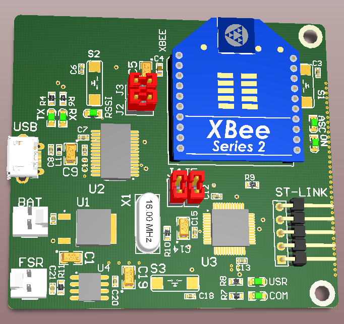

# XBEE-nodes
This is a part of my BSc thesis.

    </img>

# What's this?
The code reads an FSR sensor and interacts with XBEE S2 module to send data to the gateway.
# What's FSR?
Abbreviate for _Force Senesitive Resistor_, In our project it's used for sensing applied pressure to the pipe wall, In order to detect pipe leakage.
# Special Thanks
To my friend, [Pooya Khandel](https://github.com/PoOyaKhandel) for his support. Also I should thank Mr.MohammadReza Ahadi for his effort in making our labratory setup.